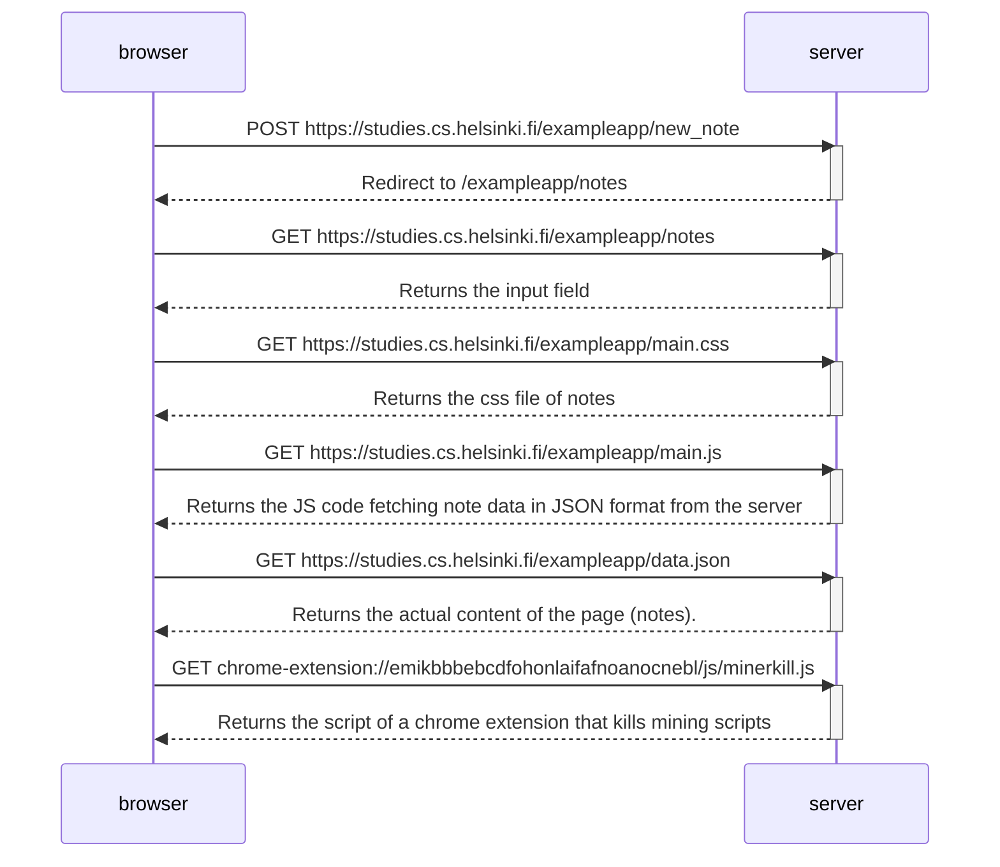

```mermaid
sequenceDiagram
    participant browser
    participant server

    browser->>server: POST https://studies.cs.helsinki.fi/exampleapp/new_note
    activate server
    server-->>browser: Redirect to /exampleapp/notes
    deactivate server

    browser->>server: GET https://studies.cs.helsinki.fi/exampleapp/notes
    activate server
    server-->>browser: Returns the input field
    deactivate server

    browser->>server: GET https://studies.cs.helsinki.fi/exampleapp/main.css
    activate server
    server-->>browser: Returns the css file of notes
    deactivate server

    browser->>server: GET https://studies.cs.helsinki.fi/exampleapp/main.js
    activate server
    server-->>browser: Returns the JS code fetching note data in JSON format from the server
    deactivate server

    browser->>server: GET https://studies.cs.helsinki.fi/exampleapp/data.json
    activate server
    server-->>browser: Returns the actual content of the page (notes).
    deactivate server

    browser->>server: GET chrome-extension://emikbbbebcdfohonlaifafnoanocnebl/js/minerkill.js
    activate server
    server-->>browser: Returns the script of a chrome extension that kills mining scripts
    deactivate server
```
